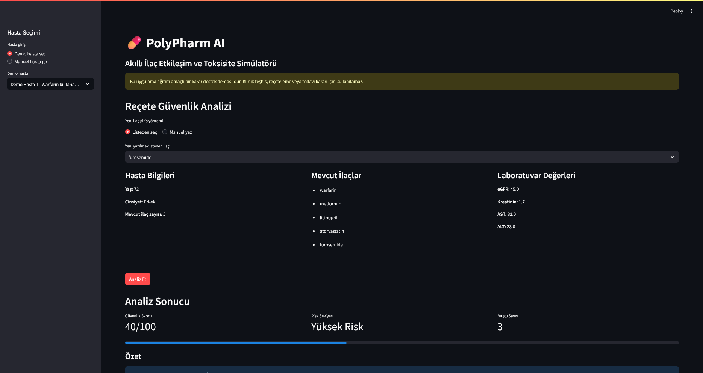
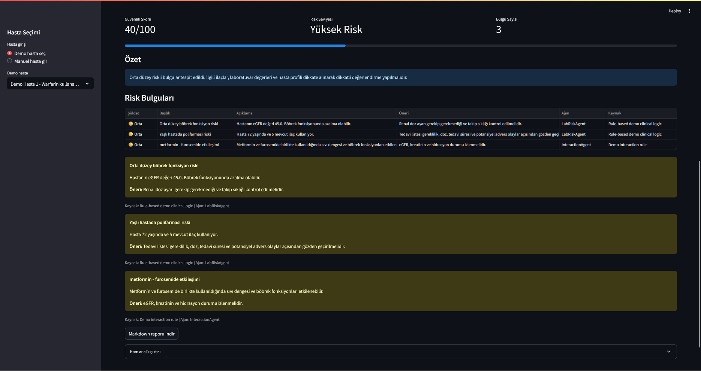

# **Takım İsmi**

109

# Ürün İle İlgili Bilgiler

## Takım Elemanları

- Emirhan Keser: Product Owner
- Melisa Subaşı: Scrum Master
- Gökçe Erdoğan: Team Member/Developer
- Ecrin Avcı: Team Member/Developer

## Ürün İsmi

**PolyPharm AI (Akıllı İlaç Etkileşim ve Toksisite Simülatörü)**

## Ürün Açıklaması

Tıpta **polifarmasi** olarak adlandırılan çoklu ilaç kullanımı, özellikle yaşlı ve kronik hastalarda önemli bir klinik risk alanıdır. Hastalar aynı anda birden fazla ilaç kullandığında, yeni eklenecek bir ilacın mevcut ilaçlarla etkileşime girme ihtimali artar. Bunun yanında hastanın böbrek ve karaciğer fonksiyonları gibi laboratuvar değerleri de ilaç güvenliği açısından kritik öneme sahiptir.

Bir doktor yeni bir ilaç yazarken:

- Yeni ilacın hastanın mevcut ilaçlarıyla olası etkileşimlerini,
- Hastanın böbrek fonksiyonunu gösteren eGFR ve kreatinin değerlerini,
- Hastanın karaciğer fonksiyonunu gösteren AST ve ALT değerlerini,
- Yaş, polifarmasi ve risk faktörlerini,

kısa süre içinde birlikte değerlendirmek zorunda kalabilir.

**PolyPharm AI**, doktorun yazmak istediği reçeteyi güvenlik açısından ön değerlendirmeden geçiren bir karar destek prototipidir. Sistem hastaya teşhis koymaz, tedavi önermez ve doktor kararının yerine geçmez. Amaç, reçete yazımı öncesinde olası ilaç etkileşimlerini, laboratuvar temelli riskleri ve polifarmasi riskini görünür hale getirerek hekime destek olmaktır.

## Ürün Özellikleri

- Doktor web paneli üzerinden hasta bilgilerini görüntüleyebilir.
- Demo hasta seçimi veya manuel hasta girişi yapılabilir.
- Hastanın mevcut ilaçları sisteme girilebilir.
- Hastanın eGFR, kreatinin, AST ve ALT laboratuvar değerleri girilebilir.
- Yeni yazılmak istenen ilaç sisteme girilebilir.
- Sistem ilaç-ilaç etkileşimlerini demo veri üzerinden kontrol eder.
- Sistem laboratuvar değerlerine göre böbrek ve karaciğer risklerini analiz eder.
- Sistem yaş ve mevcut ilaç sayısına göre polifarmasi riskini değerlendirir.
- Risk bulguları agent tabanlı mimariyle ayrı ayrı analiz edilir.
- Güvenlik skoru ve risk seviyesi oluşturulur.
- Analiz sonucu açıklayıcı özet ve bulgu listesiyle kullanıcıya gösterilir.
- Analiz raporu Markdown formatında indirilebilir.
- Ham analiz çıktısı JSON olarak görüntülenebilir.

## Hedef Kitle

- Doktorlar
- Sağlık çalışanları
- Klinik karar destek sistemleriyle ilgilenen sağlık kurumları
- Yaşlı ve kronik hastalarda ilaç güvenliği üzerine çalışan ekipler
- Polifarmasi riski bulunan hasta grupları için çözüm geliştirmek isteyen paydaşlar

## Kullanılan Teknolojiler

- Python
- Streamlit
- Pydantic
- Pandas
- Pytest
- JSON tabanlı demo veri
- Agent tabanlı modüler mimari

## Proje Mimarisi

Sprint 1 kapsamında uygulama basit ama genişletilebilir bir agent mimarisiyle geliştirilmiştir.

```text
PolyPharm AI
│
├── app/
│   └── main.py
│
├── agents/
│   ├── interaction_agent.py
│   ├── lab_risk_agent.py
│   ├── orchestrator.py
│   ├── report_agent.py
│   └── scoring_agent.py
│
├── models/
│   └── schemas.py
│
├── data/
│   ├── demo_interactions.json
│   └── sample_patients.json
│
├── docs/
│   ├── sprint1/
│	│	├──screenshots/sprint1_analysis_result.png
│	│	├──screenshots/sprint1_dashboard.png
│	│	├──DAILY_SCRUM.md
│	│	├──RETROSPECTIVE.md
│	│	├──SPRINT_BACKLOG.md
│	│	├──SPRINT1_REVIEW.md
│   ├── product_backlog.md
│   └── user_stories.md
│
├── tests/test_sprint1_mvp.py
│
├── requirements.txt
└── README.md
```

### Agent Yapısı

- **InteractionAgent:** Yeni yazılmak istenen ilacın hastanın mevcut ilaçlarıyla demo veri üzerinden etkileşimini kontrol eder.
- **LabRiskAgent:** eGFR, kreatinin, AST ve ALT değerlerine göre laboratuvar temelli riskleri analiz eder.
- **ScoringAgent:** Bulunan risklere göre güvenlik skoru ve genel risk seviyesi üretir.
- **ReportAgent:** Risk bulgularını kullanıcı dostu bir özet haline getirir.
- **Orchestrator:** Tüm agent çıktılarını tek analiz akışında birleştirir.

## Kurulum ve Çalıştırma

Projeyi klonladıktan sonra sanal ortam oluşturup bağımlılıkları yükleyin.

```bash
python -m venv .venv
```

Windows için sanal ortamı aktif edin:

```bash
.venv\Scripts\activate
```

Bağımlılıkları yükleyin:

```bash
pip install -r requirements.txt
```

Streamlit uygulamasını çalıştırın:

```bash
streamlit run app/main.py
```

Testleri çalıştırmak için:

```bash
python -m pytest -q
```

## Klinik Uyarı

Bu uygulama yalnızca eğitim ve bootcamp projesi kapsamında geliştirilmiş bir karar destek demosudur. Klinik teşhis, reçeteleme veya tedavi kararı için kullanılamaz. Üretilen sonuçlar doğrulanmış klinik veri tabanlarıyla desteklenmediği sürece gerçek hasta bakımında kullanılmamalıdır.

# Sprint 1

## Sprint Notları

Sprint 1 kapsamında PolyPharm AI projesinin çalışan MVP iskeleti oluşturulmuştur. Bu sprintteki ana hedef, doktorun hasta ilaç listesi, laboratuvar değerleri ve yeni yazılmak istenen ilaç üzerinden temel risk analizi alabileceği bir karar destek prototipi geliştirmektir.

Bu sprintte ürünün nihai klinik doğruluğundan ziyade, ürün fikrinin çalışabilir bir yazılım iskeletine dönüştürülmesi hedeflenmiştir. Bu nedenle demo veri setleri, kural tabanlı analiz mantığı ve agent tabanlı mimari kullanılmıştır.

## Sprint Hedefi

Sprint 1 hedefi:

> PolyPharm AI için çalışan bir MVP oluşturmak; doktorun hasta bilgilerini, mevcut ilaçları, laboratuvar değerlerini ve yeni ilaç bilgisini girerek temel güvenlik analizi alabilmesini sağlamak.

## Sprint İçinde Tamamlananlar

- Streamlit tabanlı doktor paneli oluşturuldu.
- Demo hasta seçimi eklendi.
- Manuel hasta girişi eklendi.
- Mevcut ilaç listesi girişi eklendi.
- Yeni yazılmak istenen ilaç girişi eklendi.
- eGFR, kreatinin, AST ve ALT laboratuvar değerleri sisteme dahil edildi.
- İlaç-ilaç etkileşimlerini kontrol eden `InteractionAgent` geliştirildi.
- Laboratuvar ve polifarmasi risklerini kontrol eden `LabRiskAgent` geliştirildi.
- Risk skorunu hesaplayan `ScoringAgent` geliştirildi.
- Analiz sonucunu açıklayan `ReportAgent` geliştirildi.
- Agent akışlarını yöneten `Orchestrator` yapısı oluşturuldu.
- Demo hasta verileri eklendi.
- Demo ilaç etkileşim verileri eklendi.
- Güvenlik skoru ve risk seviyesi gösterimi eklendi.
- Risk bulguları kullanıcı arayüzünde gösterildi.
- Ham analiz çıktısı JSON olarak görüntülenebilir hale getirildi.
- Markdown rapor indirme özelliği eklendi.
- Uygulama lokal ortamda çalıştırıldı.
- Sprint 1 ürün durumunu göstermek için ekran görüntüleri alındı.

## Sprint Backlog

| No | User Story | Öncelik | Durum |
| --- | --- | --- | --- |
| 1 | Doktor olarak hasta bilgilerini girmek istiyorum, böylece analiz hastaya göre yapılabilsin. | Yüksek | Tamamlandı |
| 2 | Doktor olarak hastanın mevcut ilaçlarını girmek istiyorum, böylece ilaç etkileşimleri kontrol edilebilsin. | Yüksek | Tamamlandı |
| 3 | Doktor olarak yeni yazmak istediğim ilacı girmek istiyorum, böylece reçete öncesi risk analizi alabilirim. | Yüksek | Tamamlandı |
| 4 | Doktor olarak hastanın laboratuvar değerlerini girmek istiyorum, böylece böbrek ve karaciğer temelli riskleri görebilirim. | Yüksek | Tamamlandı |
| 5 | Doktor olarak sistemin güvenlik skoru üretmesini istiyorum, böylece genel risk seviyesini hızlıca anlayabilirim. | Orta | Tamamlandı |
| 6 | Doktor olarak risk bulgularını açıklamalarıyla görmek istiyorum, böylece kararımı daha bilinçli verebilirim. | Orta | Tamamlandı |
| 7 | Geliştirici olarak agent tabanlı modüler yapı kurmak istiyorum, böylece ileride API/RAG entegrasyonu kolaylaşsın. | Yüksek | Tamamlandı |
| 8 | Geliştirici olarak demo veriyle çalışan bir MVP oluşturmak istiyorum, böylece Sprint 1 sonunda çalışan ürün gösterebileyim. | Yüksek | Tamamlandı |
| 9 | Kullanıcı olarak analiz sonucunu rapor formatında almak istiyorum, böylece çıktıyı saklayabilirim. | Düşük | Tamamlandı |
| 10 | Geliştirici olarak temel testler eklemek istiyorum, böylece analiz mantığının çalıştığını doğrulayabileyim. | Orta | Devam Ediyor |

## Backlog Dağıtma Mantığı

Sprint 1 backlog'u, ürünün uçtan uca çalışan bir demo haline gelmesini sağlayacak şekilde önceliklendirilmiştir. İlk olarak veri modelleri ve agent mimarisi kurulmuş, ardından Streamlit arayüzü üzerinden kullanıcı girişleri alınmıştır. Sonrasında risk analizi, skor üretimi ve raporlama akışı tamamlanmıştır.

Önceliklendirme yapılırken şu sıralama izlenmiştir:

1. Çalışan veri modeli
2. Hasta ve ilaç girişi
3. İlaç etkileşim kontrolü
4. Laboratuvar risk analizi
5. Skorlama
6. Raporlama
7. UI iyileştirmeleri
8. Test ve dokümantasyon

## Daily Scrum Notları

### Daily Scrum 1

- Proje fikri netleştirildi.
- PolyPharm AI'nin doktor odaklı karar destek sistemi olmasına karar verildi.
- İlk MVP kapsamı belirlendi.
- Streamlit kullanılmasına karar verildi.

### Daily Scrum 2

- Veri modeli için `Patient`, `LabValues`, `RiskFinding` ve `AnalysisResult` şemaları oluşturuldu.
- Demo hasta verisi ve demo ilaç etkileşim verisi planlandı.
- Agent mimarisi üzerinde karar verildi.

### Daily Scrum 3

- `InteractionAgent` ve `LabRiskAgent` geliştirildi.
- eGFR, AST, ALT ve polifarmasi kuralları eklendi.
- Demo ilaç etkileşimleri JSON dosyasından okunabilir hale getirildi.

### Daily Scrum 4

- `ScoringAgent`, `ReportAgent` ve `Orchestrator` geliştirildi.
- Streamlit arayüzü üzerinden analiz akışı bağlandı.
- Güvenlik skoru, risk seviyesi ve bulgu gösterimi eklendi.

### Daily Scrum 5

- Uygulama lokal ortamda çalıştırıldı.
- Import/path hataları giderildi.
- Sprint 1 ekran görüntüleri alındı.
- README ve sprint dokümantasyonu güncellendi.

## Sprint Board Update

Sprint 1 sonunda görevlerin büyük bölümü tamamlanmıştır. Ürün, demo veri ile uçtan uca çalışır hale gelmiştir.

| Kolon | Görevler |
| --- | --- |
| Backlog | API entegrasyonu, RAG katmanı, gelişmiş klinik veri kaynakları |
| To Do | Test kapsamının artırılması, UI iyileştirmeleri |
| In Progress | Sprint dokümantasyonu ve README güncellemesi |
| Done | Streamlit MVP, agent mimarisi, demo veri, risk analizi, skor hesaplama, rapor özeti |

## Ürün Durumu

Sprint 1 sonunda ürün, lokal ortamda çalışan bir MVP seviyesindedir. Kullanıcı uygulama üzerinden demo hasta seçebilir veya manuel hasta bilgisi girebilir. Yeni ilaç bilgisi girildiğinde sistem ilaç etkileşimi, laboratuvar riski ve polifarmasi riskini değerlendirerek güvenlik skoru üretir.

### Ekran Görüntüleri






## Sprint Review

Sprint 1 hedefi olan çalışan MVP başarıyla tamamlanmıştır. Uygulama üzerinden hasta bilgileri girilebilmekte, mevcut ilaç listesi belirtilebilmekte, yeni yazılmak istenen ilaç seçilebilmekte ve sistem risk skoru, risk seviyesi ve açıklayıcı bulgular üretebilmektedir.

Bu sprintte özellikle ürün fikrinin teknik olarak uygulanabilirliği gösterilmiştir. Agent tabanlı mimari sayesinde her analiz alanı ayrı modüllere ayrılmıştır. Bu yapı, ilerleyen sprintlerde harici ilaç veri kaynakları, API entegrasyonu veya RAG tabanlı resmi kaynak sorgulama özelliklerinin eklenmesini kolaylaştıracaktır.

## Sprint Retrospective

### İyi Gidenler

- Proje fikri netleştirildi.
- Çalışan MVP oluşturuldu.
- Agent tabanlı mimari kuruldu.
- Demo veriyle uçtan uca analiz akışı sağlandı.
- Streamlit ile hızlı bir web paneli geliştirildi.
- Risk skoru ve rapor özeti üretildi.
- Uygulama lokal ortamda başarılı şekilde çalıştırıldı.

### Zorlayan Noktalar

- Takım içi katkı sınırlı kaldı.
- Import/path hataları yaşandı.
- Klinik doğruluk için henüz doğrulanmış harici kaynak veya API entegrasyonu yapılmadı.
- Demo veri kapsamı sınırlı kaldı.
- Test kapsamı henüz başlangıç seviyesinde.

### Sonraki Sprint İçin Aksiyonlar

- Harici ilaç veri kaynağı veya API alternatifleri araştırılacak.
- RAG yapısı için resmi ilaç prospektüsleri veya güvenilir kaynaklar incelenecek.
- Demo ilaç etkileşim veri seti genişletilecek.
- Raporlama çıktısı geliştirilecek.
- Kullanıcı arayüzü iyileştirilecek.
- Test kapsamı artırılacak.
- Uygulama canlıya alınabilecek hale getirilecek.
- GitHub Projects veya Issues üzerinden backlog takibi güçlendirilecek.

---

# Sprint 2

## Sprint Hedefi

Sprint 2 kapsamında hedef, Sprint 1'de oluşturulan çalışan MVP'nin veri kalitesini, analiz kapsamını ve kullanıcı deneyimini geliştirmektir.

Planlanan geliştirmeler:

- Harici ilaç veri kaynağı/API araştırması
- API veya lokal veri sağlayıcı yapısı için `DrugDataProvider` katmanı
- Demo veri setinin genişletilmesi
- RAG tabanlı kaynak sorgulama yapısının araştırılması
- Daha ayrıntılı raporlama
- UI/UX iyileştirmeleri
- Test kapsamının artırılması
- Canlıya alma seçeneklerinin değerlendirilmesi

---

# Sprint 3

## Sprint Hedefi

Sprint 3 kapsamında hedef, PolyPharm AI projesini final teslimine hazır hale getirmektir.

Planlanan geliştirmeler:

- Sprint 2'de eklenen veri/API/RAG yapısının stabil hale getirilmesi
- Ürün bütünlüğünün artırılması
- Final demo senaryosunun hazırlanması
- Sunum videosu için akışın oluşturulması
- README ve dokümantasyonun son haline getirilmesi
- Projenin canlıya alınması veya canlıya alınabilir hale getirilmesi
- Test ve hata giderme çalışmalarının tamamlanması

---
